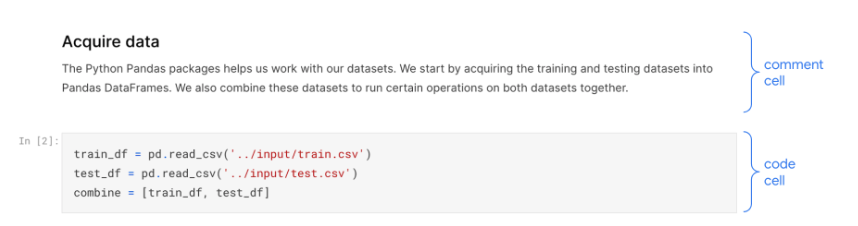

# Understanding Code in Python Notebooks
## About The Project

### Project Goal
In this project, we want to built a model to predict the correct ordering of the cells in a given notebook whose markdown cells have been shuffled. We hope the result can help us in understanding the relationships between code and markdown. We built a Pairwise and a Ranking model by leveraging Feed-Forward Neural Network with Pytorch.

### Dataset
The dataset is from a [Kaggle compitition](https://www.kaggle.com/competitions/AI4Code). The data consisted of 160,000 Jupyter Notebook, with 139,226 being the training notebooks. However, we only used 1,000 samples as our training data. 
All notebooks:
* Have been published publicly on Kaggle.
* Represent the most recently version of the notebook.
* Contain at least one code cell and markdown cell each.
* Have code written in the Python language.
* Have had empty cells removed.

 <p align="center"></p>

### What is DAN?
 
 <p align="center"></p>

DAN stands for Deep Averaging Network. It is a simple Neural Network that learns the compositionality of the inputs. The architecture of DAN looks like the picture above. First of all, it take the vector average of the input word embeddings, then pass it through 1 or more feed-forward layers. Intuition being that each layer will increasingly magnify small but meaningful differences in the word embedding average. Fianlly, perform Linear classification on final layer. Despite its simplicity, DAN outperforms many other more sophisticated models which are designed to explicitly learn the compositionality of texts. For example, DAN outperforms syntactic models on datasets with high syntactic variance. So we first devoted our efforts to trying this architecture.


### Method

After checking that there is no imbalance issue, we did some preprocessing and feature engineering, getting the words from twitter text into clear and normalized format. For word representation, we used pretrained embeddings ([Stanford GloVe](https://nlp.stanford.edu/projects/glove/)) instead of word2vec model consideing that the dataset is relatively small. By doing this, we can exploit some transfer learning from the pretrained embeddings. As for model building, we created a 3-layer Deep Averaging Neural Network. It views text as a bag of words and takes the average of the word embeddings as the representation of the twitter text. 

### Further Steps

We think that there are still a lot of methods to solve this problem. For example, we want to try deeper neural network with current model.  It may need more computational resource, and increasing the number of hidden layers might improve the accuracy or might not, it depends on the complexity of the problem, but it still worth a try. Or we can also try RNN/CNN-based model like GRU or LSTM. Another possible better solution is to create text features with bag-of-ngrams. Bag of n-grams can be more informative than bag of words because they capture more context around each word. Finally, we can try other pretrained embeddings like standford twitter glove or directly exploit pretained models like BERT.

## Getting Started

### Prerequisites

In this project, we need to use Pandas, Numpy, and PyTorch with Python 3.5.0 or greater.


### Installation

* Pytorch
  ```sh
  pip3 install torch torchvision
  ```

## Usage and result
 
 Our model with this very simple architecture performs surprisingly well, obtaining over 80% accuracy in both the training and the validating set.
 
 <p align="center"></p>

## Contributor

[Min Che](https://www.linkedin.com/in/min-che/)

[Eileen Wang](https://www.linkedin.com/in/eileen-wang-ba8048159/) 
